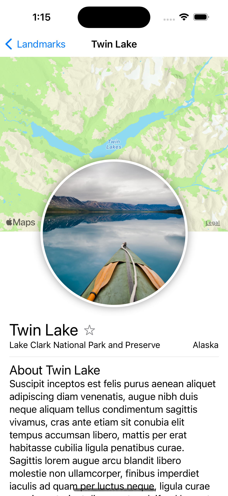
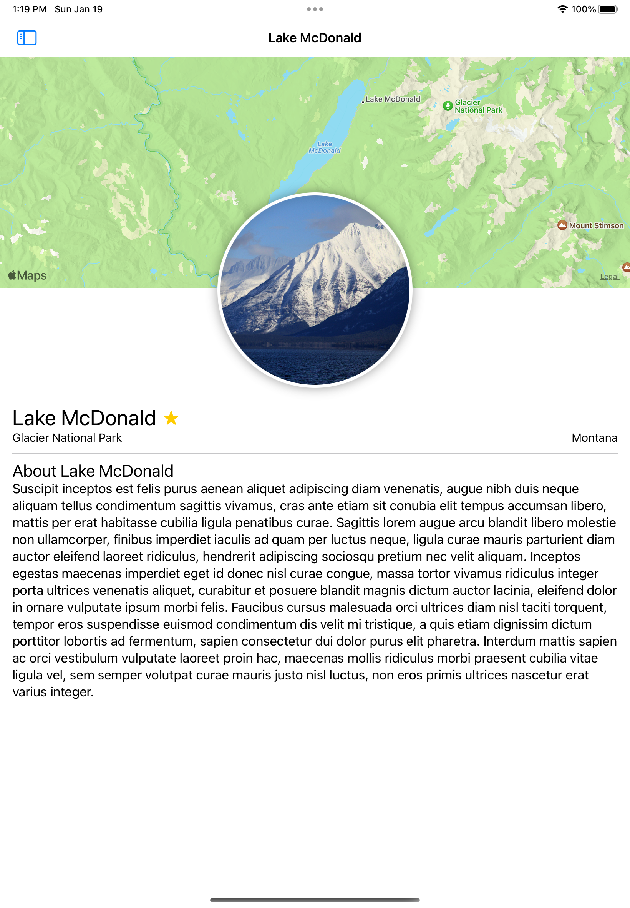
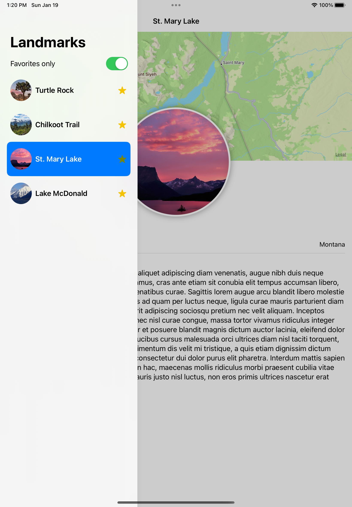
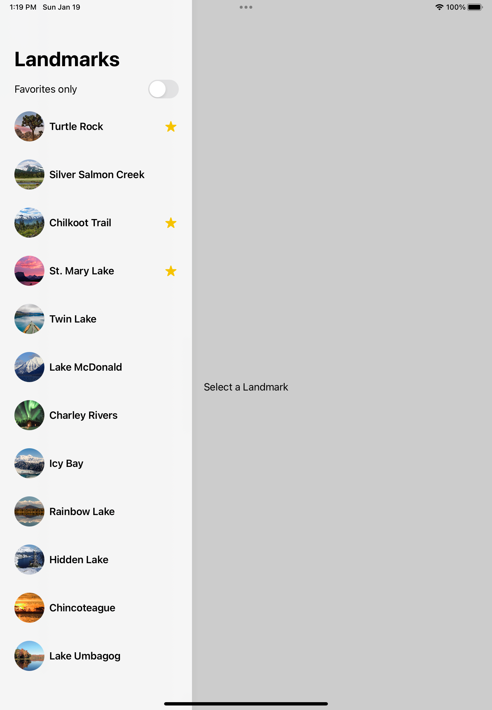

# Landmark SwiftUI App

A SwiftUI-based app showcasing a list of landmarks. The app includes a detailed view for each landmark and integrates features such as displaying maps, images, and the ability to mark landmarks as favorites.

       

## Features

- Display a list of landmarks with name, image, and park info.
- View detailed information about each landmark.
- Mark landmarks as favorites.
- Display a map showing the location of each landmark.

## Requirements

- iOS 16 or below
- Xcode 14.0 or below
- Swift 5.0+

## Installation

1. Clone the repository:
   
   git clone https://github.com/vikaspanwar33/LandmarkSwiftUI.git

3. Open the project in Xcode:
   
   open LandmarkSwiftUI.xcodeproj
   Run the app on a simulator or connected device.
